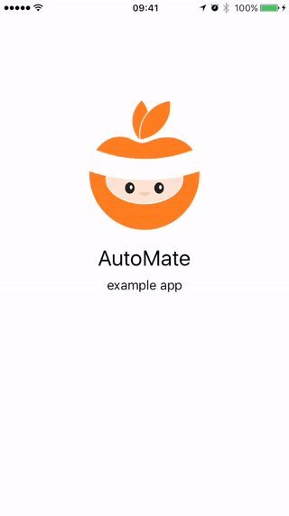

<div>
    
    <br />
    
</div>

# AutoMate

`AutoMate` is a Swift framework containing a set of helpful `XCTest` extensions for writing UI automation tests. It provides strongly typed, extensible wrapper around launch arguments and environment variables, which can be used for language, locale and keyboard type configuration on the device.

[](https://swift.org/)
[](https://travis-ci.org/PGSSoft/AutoMate/)
[](https://cocoapods.org/pods/AutoMate)
[](https://github.com/Carthage/Carthage)
[](http://cocoadocs.org/docsets/AutoMate)
[](https://github.com/PGSSoft/AutoMate/blob/master/LICENSE)



## Installation

The most convenient way to install it is by using [Cocoapods](https://cocoapods.org/) with Podfile:

```ruby
pod 'AutoMate'
```

or using [Carthage](https://github.com/Carthage/Carthage) and add a line to `Cartfile.private`:

```
github "PGSSoft/AutoMate"
```

`Cartfile.private` should be used because AutoMate framework will be used by UI Tests target only not by the tested application.

## Usage

1. Create a new UI test case class.
2. Import `AutoMate` framework to UI tests files:

    ```swift
    import AutoMate
    ```

3. Use `TestLauncher` in the `setup()` method to configure application settings and launch the application:

    ```swift
    let app = XCUIApplication()
    TestLauncher(options: [
        SystemLanguages([.English, .German]),
        SystemLocale(language: .English, country: .Canada),
        SoftwareKeyboards([.EnglishCanada, .GermanGermany])
    ]).configure(app).launch()
    ```

4. Use AutoMate's extensions in your tests. For example:

    ```swift
    func testSomething() {
        let app = XCUIApplication()
        let button = app.button.element

        // helper for waiting until element is visible
        waitForVisibleElement(button, timeout: 20)
        button.tap()

        // isVisible - helper to check that element both exists and is hittable
        XCTAssertFalse(button.isVisible)
    }
    ```

## Features (or ToDo)

- [x] Set keyboards
- [x] Set locale
- [x] Set languages
- [x] Custom arguments
- [x] Custom keyboards, locales and languages
- [x] `XCTest` extensions
- [x] Added CoreData launch arguments
- [ ] Disable UIView animations
- [ ] Strong-typed helpers: localizers, view object templates
- [ ] Base XCTestCase template
- [ ] Improve handling of system alerts
- [ ] Companion library for the app
- [ ] Stubbing network requests
- [ ] Stubbing contacts, events and reminders
- [ ] Making screenshots
- [ ] Clearing application data
- [ ] Stubbing notifications

## Example application

Repository contains example application under `./AutoMateExample/` directory. Structure of the app is simple, but the project contains extensive suite of UI tests to showcase capabilities of the library.

## Development

If you want to provide your custom launch argument or launch environment you have to implement `LaunchOption` protocol or one of its extensions, such as `LaunchArgumentWithSingleValue`:

```swift
enum CustomParameter: String, LaunchArgumentWithSingleValue, LaunchArgumentValue {
    var argumentKey: String {
        return "AppParameter"
    }
    case value1
    case value2
}
```

Then, you can pass it to the `TestBuilder`:

```swift
let launcher = TestLauncher(options: [
    CustomParameter.value1
])
```

## Contributing

Bug reports and pull requests are welcome on GitHub at [https://github.com/PGSSoft/AutoMate](https://github.com/PGSSoft/AutoMate).

## License

The project is available as open source under the terms of the [MIT License](http://opensource.org/licenses/MIT).

## About
The project maintained by [software development agency](https://www.pgs-soft.com/) [PGS Software](https://www.pgs-soft.com/).
See our other [open-source projects](https://github.com/PGSSoft) or [contact us](https://www.pgs-soft.com/contact-us/) to develop your product.

## Follow us

[](https://twitter.com/intent/tweet?text=https://github.com/PGSSoft/AutoMate)  
[](https://twitter.com/pgssoftware)
